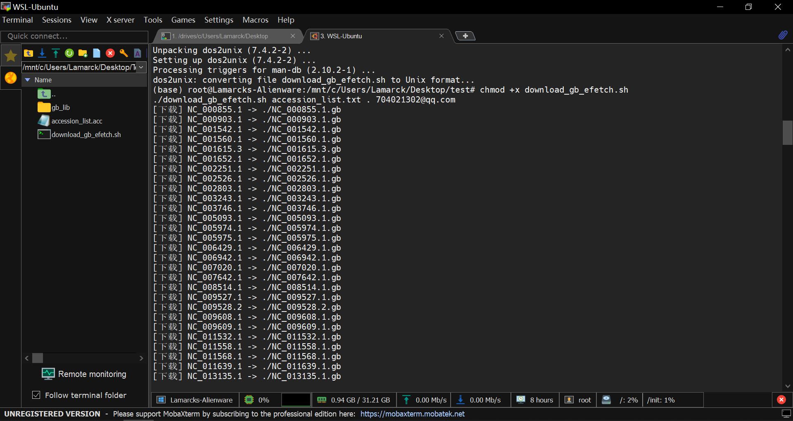
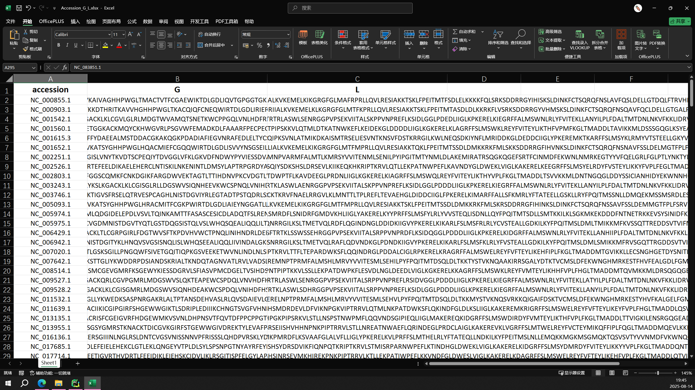

## 一套小流程，用于批处理Genbank文件，并提取蛋白序列 &nbsp; &nbsp; &nbsp; 2025-08-13
---

### 环境: Win10, WSL

#### Step1 ----- 在NCBI Virus上Download所需accession，得到一个.acc文件


#### Step2 ----- 将accession列表命名为accession_list.txt，编写批处理脚本，用于自动下载，详见download_gb_efetch.sh（与accession_list.txt放在同一目录下）
```bash
#!/usr/bin/env bash
# download_gb_efetch.sh
# 用法: ./download_gb_efetch.sh accession_list.txt out_dir [email] [api_key]

set -euo pipefail

if [[ $# -lt 2 ]]; then
  echo "用法: $0 accession_list.txt out_dir [email] [api_key]"
  exit 1
fi

ACC_FILE="$1"
OUT_DIR="$2"
EMAIL="${3:-}"
API_KEY="${4:-}"

mkdir -p "$OUT_DIR"

while IFS= read -r acc || [[ -n "$acc" ]]; do
  # 跳过空行和注释行
  [[ -z "$acc" || "$acc" =~ ^# ]] && continue
  out="$OUT_DIR/${acc}.gb"
  if [[ -s "$out" ]]; then
    echo "[跳过] $out 已存在且非空"
    continue
  fi
  url="https://eutils.ncbi.nlm.nih.gov/entrez/eutils/efetch.fcgi"
  params="db=nuccore&id=${acc}&rettype=gb&retmode=text"
  [[ -n "$EMAIL" ]] && params="${params}&email=${EMAIL}"
  [[ -n "$API_KEY" ]] && params="${params}&api_key=${API_KEY}"

  echo "[下载] ${acc} -> ${out}"
  for attempt in {1..5}; do
    http_code=$(curl -sSL --retry 5 --retry-delay 2 --connect-timeout 10 \
      -w "%{http_code}" -o "$out".tmp "${url}?${params}" || true)
    if [[ "$http_code" == "200" ]] && grep -q "^LOCUS" "$out".tmp; then
      mv "$out".tmp "$out"
      break
    else
      echo "  尝试 ${attempt} 失败 (HTTP ${http_code})"
      sleep $((attempt*2))
    fi
    if [[ "$attempt" -eq 5 ]]; then
      echo "  错误: 放弃 ${acc}"; rm -f "$out".tmp
    fi
  done
done < "$ACC_FILE"

echo "下载完成"
```

#### Step3 ----- 给脚本添加可执行权限
```bash
chmod +x download_gb_efetch.sh
```

#### Step4 ----- 根据accession_list，自动下载
```bash
./download_gb_efetch.sh accession_list.txt . you@example.com
# you@example.com → 你的邮箱（随便填一个格式正确的）
```
#### 如果出现这个报错
```bash
/usr/bin/env: ‘bash\r’: No such file or directory
```
```bash
是由于download_gb_efetch.sh文件是在Windows下保存的，里面的换行符是CRLF(\r\n)，而Linux/WSL需要的是LF(\n)。它让/usr/bin/env bash这一行读成了bash\r，所以报错找不到命令。
```

#### 使用dos2unix把CRLF换行转换成LF，就能在Linux中正常运行了,成功运行的截图见下，把下载好的所有gb文件放在lib文件夹下。
```bash
sudo apt-get update
sudo apt-get install dos2unix
dos2unix download_gb_efetch.sh
```


#### Step5 ----- 把这些gb文件中的蛋白序列提取出来，保存在一个csv中（各列分别是：Accession; G; L; N; M; P）,详见protein_extract.py
```python
# extract_rhabdo_proteins_to_csv_windows.py
# 从 GenBank 批量提取 Rhabdoviridae 的 G/L/N/M/P 蛋白氨基酸序列
# 输出 CSV 列顺序：accession(带版本号), G, L, N, M, P

import csv
import re
from pathlib import Path
from typing import Dict, Optional
from Bio import SeqIO

# === 输入/输出目录 ===
BASE_DIR = r"C:\Users\Lamarck\Desktop\test\gb_lib"

TARGETS = ["G", "L", "N", "M", "P"]

def classify_protein(qual: Dict[str, list]) -> Optional[str]:
    """根据 gene / product 判断该 CDS 属于哪一个蛋白（G/L/N/M/P）。"""
    def qget(key):
        v = qual.get(key, [])
        return v[0] if v else ""

    gene = qget("gene").strip().upper()
    product = qget("product").strip().lower()

    if gene in TARGETS:
        return gene

    # G 蛋白
    if re.search(r"\bglycoprotein\b", product, flags=re.I) \
            or re.search(r"\bG protein\b", product, flags=re.I) \
            or (len(product.strip()) <= 3 and re.search(r"\bG\b", product, flags=re.I)):
        return "G"

    # L 蛋白
    if re.search(r"\bpolymerase\b", product, flags=re.I) \
            or re.search(r"\brna-dependent rna polymerase\b", product, flags=re.I) \
            or re.search(r"\blarge protein\b", product, flags=re.I) \
            or re.search(r"\bL protein\b", product, flags=re.I) \
            or re.search(r"\bRdRp\b", product, flags=re.I) \
            or (len(product.strip()) <= 3 and re.search(r"\bL\b", product, flags=re.I)):
        return "L"

    # N 蛋白
    if re.search(r"\bnucleoprotein\b", product, flags=re.I) \
            or re.search(r"\bnucleocapsid protein\b", product, flags=re.I) \
            or re.search(r"\bN protein\b", product, flags=re.I) \
            or (len(product.strip()) <= 3 and re.search(r"\bN\b", product, flags=re.I)):
        return "N"

    # M 蛋白
    if re.search(r"\bmatrix protein\b", product, flags=re.I) \
            or re.search(r"\bM protein\b", product, flags=re.I) \
            or (len(product.strip()) <= 3 and re.search(r"\bM\b", product, flags=re.I)):
        return "M"

    # P 蛋白
    if re.search(r"\bphosphoprotein\b", product, flags=re.I) \
            or re.search(r"\bP protein\b", product, flags=re.I) \
            or (len(product.strip()) <= 3 and re.search(r"\bP\b", product, flags=re.I)):
        return "P"

    return None

def get_translation(record, feature) -> Optional[str]:
    """获取 CDS 的氨基酸序列。优先用 translation；缺失则翻译核酸。"""
    q = feature.qualifiers
    if "translation" in q and q["translation"]:
        return "".join(q["translation"]).replace(" ", "").replace("\n", "")
    try:
        dna = feature.extract(record.seq)
        codon_start = int(q.get("codon_start", [1])[0])
        transl_table = int(q.get("transl_table", [1])[0])
        if codon_start > 1:
            dna = dna[codon_start - 1 :]
        aa = str(dna.translate(table=transl_table, to_stop=True))
        return aa.replace("*", "")
    except Exception:
        return None

def get_accession_with_version(record) -> str:
    """优先返回 record.id（通常带版本号），否则尝试 VERSION 字段。"""
    acc = record.id.strip()
    if acc and re.search(r"\.\d+$", acc):
        return acc
    version = record.annotations.get("sequence_version")
    if version:
        return f"{record.name}.{version}"
    return acc or "unknown"

def extract_from_gb(gb_path: Path) -> Dict[str, str]:
    """从单个 GenBank 文件提取 accession(带版本号) 和五种目标蛋白序列。"""
    results = {k: "" for k in TARGETS}
    accession = None

    for record in SeqIO.parse(str(gb_path), "genbank"):
        accession = get_accession_with_version(record)
        for feat in record.features:
            if feat.type != "CDS":
                continue
            kind = classify_protein(feat.qualifiers)
            if not kind:
                continue
            aa = get_translation(record, feat)
            if not aa:
                continue
            if len(aa) > len(results[kind]):
                results[kind] = aa
        break

    if accession is None:
        accession = gb_path.stem
    results["accession"] = accession
    return results

def main():
    base = Path(BASE_DIR)
    if not base.exists():
        raise SystemExit(f"目录不存在：{base}")

    gb_files = sorted([p for p in base.iterdir() if p.suffix.lower() in (".gb", ".gbk")])
    if not gb_files:
        raise SystemExit(f"未找到 .gb/.gbk 文件：{base}")

    out_csv = base / "rhabdo_proteins.csv"
    header = ["accession", "G", "L", "N", "M", "P"]

    total = len(gb_files)
    print(f"发现 {total} 个 GenBank 文件，开始处理…")

    with out_csv.open("w", newline="", encoding="utf-8") as f:
        writer = csv.DictWriter(f, fieldnames=header)
        writer.writeheader()
        for i, gb in enumerate(gb_files, 1):
            try:
                row = extract_from_gb(gb)
            except Exception as e:
                print(f"[警告] 解析失败：{gb.name} -> {e}")
                row = {"accession": gb.stem, "G": "", "L": "", "N": "", "M": "", "P": ""}
            writer.writerow({k: row.get(k, "") for k in header})
            if i % 20 == 0 or i == total:
                print(f"[进度] {i}/{total}")

    print(f"完成！结果已保存到：{out_csv}")

if __name__ == "__main__":
    main()
```

#### Step6 ----- 把需要分析的蛋白留下，整理成这样的格式（accession + protein + protein），命名为Accession_G_L.xlsx


#### Step7 ----- 用一个Python脚本把G、L分别提取成fasta文件的格式，详见fasta_extract.py
```python
import re
from pathlib import Path
import pandas as pd

# ===== 1) 输入 Excel 路径 & 列名（如与你文件不一致，请改这里） =====
excel_file = Path(r"C:\Users\Lamarck\Desktop\Accession_G_L.xlsx")
accession_col = "accession"   # 第一列：样本 accession（含版本号更好）
g_col = "G"                   # 第二列：G 蛋白氨基酸序列
l_col = "L"                   # 第三列：L 蛋白氨基酸序列
sheet_name = 0                # 读取第一个工作表，如需指定表名可填字符串

# ===== 2) 工具函数 =====
def wrap_fasta(seq: str, width: int = 60) -> str:
    """按指定宽度换行（FASTA 常用 60）"""
    return "\n".join(seq[i:i+width] for i in range(0, len(seq), width))

def clean_seq(seq: str) -> str:
    """清理序列：去空白字符，转大写。"""
    seq = re.sub(r"\s+", "", seq)  # 去掉所有空白（空格、换行、制表等）
    return seq.upper()

def _to_str(x):
    """把可能为 NaN 的对象安全转字符串；若为空返回空串。"""
    if pd.isna(x):
        return ""
    return str(x)

# ===== 3) 读取 Excel =====
df = pd.read_excel(excel_file, sheet_name=sheet_name)

# 检查列是否存在
missing_cols = [c for c in [accession_col, g_col, l_col] if c not in df.columns]
if missing_cols:
    raise ValueError(
        f"找不到这些列：{missing_cols}。当前表头为：{list(df.columns)}。\n"
        f"请修改脚本顶部的列名设置。"
    )

# ===== 4) 输出目录（与 Excel 同目录） =====
out_dir = excel_file.parent
g_fasta_path = out_dir / "G.fasta"
l_fasta_path = out_dir / "L.fasta"

# ===== 5) 写 G.fasta =====
with open(g_fasta_path, "w", encoding="utf-8") as g_out:
    for _, row in df.iterrows():
        acc = _to_str(row[accession_col]).strip()
        seq = clean_seq(_to_str(row[g_col]))
        if not acc or not seq:
            continue  # 跳过空 accession 或空序列
        g_out.write(f">{acc}\n{wrap_fasta(seq, 60)}\n")

# ===== 6) 写 L.fasta =====
with open(l_fasta_path, "w", encoding="utf-8") as l_out:
    for _, row in df.iterrows():
        acc = _to_str(row[accession_col]).strip()
        seq = clean_seq(_to_str(row[l_col]))
        if not acc or not seq:
            continue
        l_out.write(f">{acc}\n{wrap_fasta(seq, 60)}\n")

print(f"已生成：\n  {g_fasta_path}\n  {l_fasta_path}")
```
